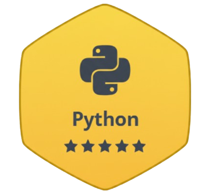

<!-- Ansh Soni Profile -->

<h1 align="center">
  
</h1>

<div align="center">
  
</div>

```python
class AnshSoni:
    def __init__(self):
        self.name = "Ansh Soni"
        self.role = "Backend Developer | Software Engineer"
        self.location = "India 🇮🇳"
        self.education = "Computer Science Engineering"
        self.tech_stack = {
            "languages": ["Python", "C++", "SQL"],
            "backend": ["FastAPI", "Django", "PostgreSQL", "MySQL"],
            "quantum": ["Qiskit"],
            "devops": ["Docker", "Linux", "Git"],
            "tools": ["Postman", "Grafana", "VSCode"]
        }
        self.currently_learning = ["Quantum Computing", "AI/ML", "System Design"]
        self.current_projects = [
            "PyShell - Advanced Python Shell",
            "Smart Career Recommendation System",
            "eSevak - Bridging NGOs and Societies",
            "QuaSim - Quantum Simulation Platform"
        ]
        self.achievements = {
            "Finalist": "NASA Space App Challenge Hackathon",
            "Scholar": "Reliance Foundation Undergraduate Scholar",
            "Projects": "10+ Live Applications",
            "Open Source": "Active Contributor"
        }
    
    def say_hi(self):
        print("Thanks for visiting! Let's build something amazing together.")

me = AnshSoni()
me.say_hi()
```

 <a href="https://github.com/sponsors/AnshMNSoni" target="_blank">
  
</a>

 
<br><br><br>


# My Activity

<a href="https://next.ossinsight.io/widgets/official/compose-user-dashboard-stats?user_id=145273012" target="_blank" style="display: block">
  <picture>
    <source media="(prefers-color-scheme: dark)" srcset="https://next.ossinsight.io/widgets/official/compose-user-dashboard-stats/thumbnail.png?user_id=145273012&image_size=auto&color_scheme=dark" width="771" height="auto">
    
  </picture>
</a>
<br><br>

# Explored Tech


<br>

# DSA Stats




<br>

# Development Stats


<br>

# My Development Breakdown
<!--START_SECTION:waka-->
```text
Working on Live Projects          [█████████████████░░░░░░░░]  40%
Learning New Skills               [████████░░░░░░░░░░░░░░░░░]  20%
DSA Practice                      [██████░░░░░░░░░░░░░░░░░░░]  15%
Contributing to Opensource        [█████░░░░░░░░░░░░░░░░░░░░]  15%
Rest & Recreation                 [████░░░░░░░░░░░░░░░░░░░░░]  10%
```
<!--END_SECTION:waka-->

<br>

# Reach Out to Me

[](mailto:ansh.mn.soni7505@gmail.com) [](https://www.linkedin.com/in/anshmnsoni/) [](https://www.hackerrank.com/profile/anshsoni702) [](https://leetcode.com/u/anshmnsoni/) [](https://anshsoni.dev/)
<br><br>


<br>
<a href="https://next.ossinsight.io/widgets/official/compose-activity-trends?repo_id=823648550" target="_blank" style="display: block" align="center">
  <picture>
    <source media="(prefers-color-scheme: dark)" srcset="https://next.ossinsight.io/widgets/official/compose-activity-trends/thumbnail.png?repo_id=823648550&image_size=auto&color_scheme=dark" width="815" height="auto">
    
  </picture>
</a>

<br><br>

**💭 "कर्मण्येवाधिकारस्ते मा फलेषु कदाचन"**

*You have the right to work, but never to the fruit of work.*


