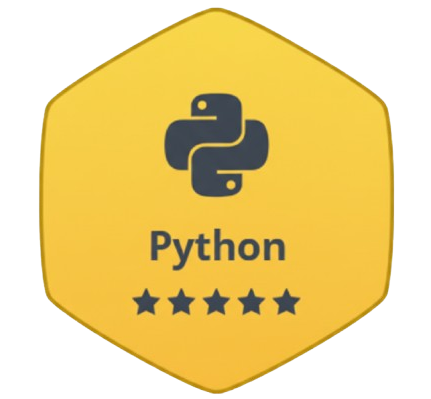

<!-- Ansh Soni Profile -->

<h1 align="center">
  
</h1>

<div align="center">
  
</div>

```python
class AnshMNSoni:
    def __init__(self):
        self.name = "Ansh Soni"
        self.role = "Software Engineer"
        self.location = "India 🇮🇳"
        self.education = "Computer Science Engineering"
        self.tech_stack = {
            "languages": ["Python", "C++", "SQL"],
            "backend": ["FastAPI", "Django", "PostgreSQL", "MySQL"],
            "quantum": ["Qiskit"],
            "devops": ["Docker", "Linux", "Git"],
            "tools": ["Postman", "VSCode"]
        }
        self.currently_exploring = ["System Design", "Agentic AI"]
        self.current_projects = [
            "PythonSTL - C++ style Standard Template Library",
            "Disee - A Simple Query Processing Engine",
            "LinkLite - A URL Shortner"
        ]
        self.achievements = {
            "Zonal Finalist": "NASA Space App Challenge Hackathon 2025",
            "Scholar": "Reliance Foundation Undergraduate Scholar",
            "GSSoC'26": "Open Source Active Contributor"
        }
    
    def connect(self):
        print("Thanks for visiting! Let's build something amazing together.")

me = AnshMNSoni()
me.connect()
```

 <a href="https://github.com/sponsors/AnshMNSoni" target="_blank">
  
</a>

 
<br><br><br>

# Explored Tech


<br>

# Live Projects

<table>
  <tr>
    <td width="50%" valign="top">
      <h2>1️⃣ B2B-RFP Agent</h2>
      <sub>AI-powered agent that automates B2B Request for Proposal generation and responses.</sub>
      <br/><br/>
      <a href="https://github.com/AnshMNSoni/B2B-RFP-Agent">
        
      </a>
      <a href="https://rfp-agent-ai.onrender.com/">
        
      </a>
    </td>
    <td width="50%" valign="top">
      <h2>2️⃣ Prithvi Netra</h2>
      <sub>Earth observation and satellite data analysis platform for environmental monitoring.</sub>
      <br/><br/>
      <a href="https://github.com/AnshMNSoni/Prithvi-Netra">
        
      </a>
      <a href="https://prithvi-netra.onrender.com/">
        
      </a>
    </td>
  </tr>
  <tr>
    <td width="50%" valign="top">
      <h2>3️⃣ Nari Kawach</h2>
      <sub>Women's safety app with real-time alerts, emergency contacts, and location tracking.</sub>
      <br/><br/>
      <a href="https://github.com/AnshMNSoni/NariKawach">
        
      </a>
      <a href="https://nari-kawach-zeta.vercel.app/">
        
      </a>
    </td>
    <td width="50%" valign="top">
      <h2>4️⃣ HireLens</h2>
      <sub>AI-driven resume parser that extracts structured candidate data for smart hiring.</sub>
      <br/><br/>
      <a href="https://github.com/AnshMNSoni/HireLens">
        
      </a>
      <a href="https://hirelens-mauve.vercel.app/">
        
      </a>
    </td>
  </tr>
  <tr>
    <td width="50%" valign="top">
      <h2>5️⃣ Nirogya</h2>
      <sub>AI health assistant for symptom checking, wellness tracking, and medical guidance.</sub>
      <br/><br/>
      <a href="https://github.com/AnshMNSoni/Nirogya">
        
      </a>
      <a href="https://nirogya-health.netlify.app/">
        
      </a>
    </td>
    <td width="50%" valign="top">
      <h2>6️⃣ QuaSim</h2>
      <sub>Quantum circuit simulation platform with Qiskit-powered visualization and qubit control.</sub>
      <br/><br/>
      <a href="https://github.com/AnshMNSoni/QuaSim">
        
      </a>
      <a href="https://quasimdottech.netlify.app/">
        
      </a>
    </td>
  </tr>
  <tr>
    <td width="50%" valign="top">
      <h2>7️⃣ LinkLite</h2>
      <sub>Minimal and fast URL shortener with analytics and custom alias support.</sub>
      <br/><br/>
      <a href="https://github.com/AnshMNSoni/LinkLite">
        
      </a>
      <a href="https://linklite-hfud.onrender.com/">
        
      </a>
    </td>
    <td width="50%" valign="top">
      <h2>8️⃣ Lakshya</h2>
      <sub>Goal tracking and productivity platform to set, monitor, and achieve personal milestones.</sub>
      <br/><br/>
      <a href="https://github.com/AnshMNSoni/Project-Lakshya">
        
      </a>
      <a href="https://project-lakshya.lovable.app/">
        
      </a>
    </td>
  </tr>
</table>

# DSA Stats




<br>

# Development Stats


<br>

# Find Me On

[](mailto:ansh.mn.soni7505@gmail.com) [](https://www.linkedin.com/in/anshmnsoni/) [](https://anshsoni.dev/) [](https://peerlist.io/anshmnsoni) [](https://medium.com/@anshsoni702) [](https://www.reddit.com/user/AnshMNSoni/) [](https://leetcode.com/u/XYZ2005/) [](https://www.hackerrank.com/profile/anshsoni702) [](https://www.kaggle.com/anshmnsoni) [](https://monkeytype.com/profile/anshmnsoni)
<br><br>


<br>
<a href="https://next.ossinsight.io/widgets/official/compose-activity-trends?repo_id=823648550" target="_blank" style="display: block" align="center">
  <picture>
    <source media="(prefers-color-scheme: dark)" srcset="https://next.ossinsight.io/widgets/official/compose-activity-trends/thumbnail.png?repo_id=823648550&image_size=auto&color_scheme=dark" width="815" height="auto">
    
  </picture>
</a>

<br><br>

**💭 "कर्मण्येवाधिकारस्ते मा फलेषु कदाचन"**

*You have the right to work, but never to the fruit of work.*


